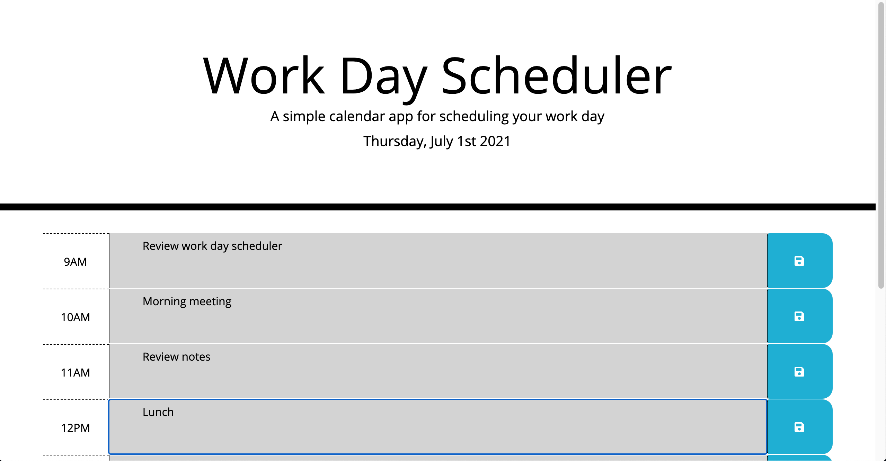

# work-day-scheduler

This site is a simple work day planner to help users organize their day. The app updates live to show past, present and future time blocks. Users can save their events to persist in local storage.

## Built With

* [HTML](https://developer.mozilla.org/en-US/docs/Web/HTML)
* [CSS](https://developer.mozilla.org/en-US/docs/Web/CSS)
* [JavaScript](https://developer.mozilla.org/en-US/docs/Web/JavaScript)
* [BootStrap](https://stackpath.bootstrapcdn.com/bootstrap/4.3.1/css/bootstrap.min.css)
* [JQuery](https://code.jquery.com/jquery-3.3.1.slim.min.js)
* [FontAwesome](https://use.fontawesome.com/releases/v5.8.1/css/all.css)

## Deployed Link

* [See Live Site](https://trevcoons.github.io/work-day-scheduler/)

## Authors

* **Trevor Coons** 

- [Link to Portfolio Site](https://trevcoons.github.io/trevors-portfolio/)
- [Link to Github](https://github.com/trevcoons)
- [Link to LinkedIn](www.linkedin.com/in/trevor-coons-2a948a104)

## Acknowledgments

Thanks to UC Berkeley Coding Bootcamp for teaching me HTML, JavaScript, JQuery, and BootStrap.
